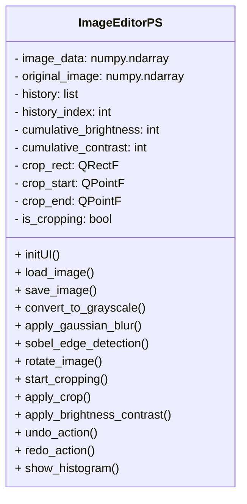
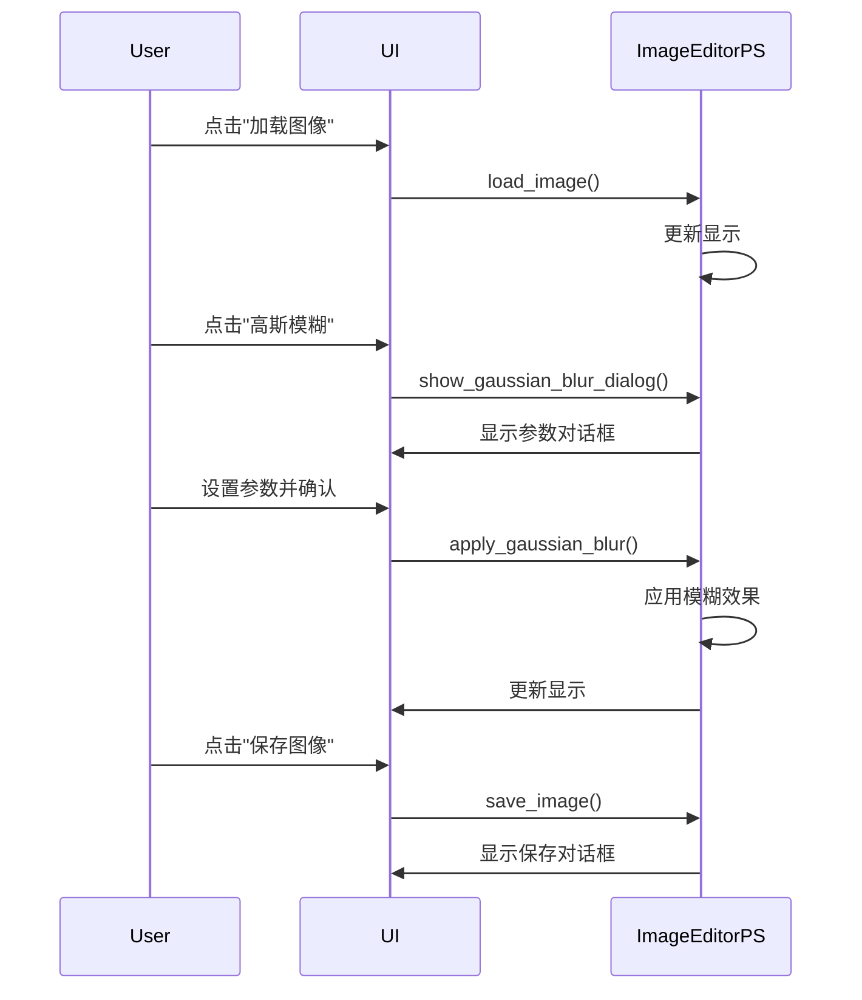

# ImageEditorPS 图像处理软件分析

## 1. 类结构概述



## 2. 核心算法实现

### 2.1 高斯模糊算法

```python
def gaussian_kernel(self, size, sigma=1.0):
    """生成高斯核"""
    # 二维高斯函数:
    \[
    G(x,y) = \frac{1}{2\pi\sigma^2}e^{-\frac{x^2+y^2}{2\sigma^2}}
    \]
    kernel = np.zeros((size, size))
    center = size // 2
    
    for i in range(size):
        for j in range(size):
            x, y = i - center, j - center
            kernel[i, j] = np.exp(-(x**2 + y**2)/(2*sigma**2))
    
    kernel /= kernel.sum()  # 归一化
    return kernel

def convolve2d(self, image, kernel):
    """二维卷积实现"""
    kernel = np.flipud(np.fliplr(kernel))  # 翻转核
    kh, kw = kernel.shape
    ih, iw = image.shape
    
    # 输出图像
    output = np.zeros_like(image)
    
    # 填充图像
    pad = kh // 2
    padded = np.pad(image, pad, mode='reflect')
    
    # 卷积运算
    for i in range(ih):
        for j in range(iw):
            output[i, j] = np.sum(padded[i:i+kh, j:j+kw] * kernel)
            
    return output
```

调用流程：
1. 用户点击"高斯模糊"按钮 → `show_gaussian_blur_dialog()`
2. 用户设置参数后 → `apply_gaussian_blur(kernel_size, sigma)`
3. 内部调用 `gaussian_kernel()` 生成核
4. 调用 `convolve2d()` 进行卷积运算

### 2.2 Sobel边缘检测

```python
def sobel_edge_detection(self):
    """改进的Sobel边缘检测(使用纯numpy实现)"""
    # Sobel算子
    # 水平梯度算子Gx和垂直梯度算子Gy:
    \[
    G_x = \begin{bmatrix}
    -1 & 0 & 1 \\
    -2 & 0 & 2 \\
    -1 & 0 & 1
    \end{bmatrix}, \quad
    G_y = \begin{bmatrix}
    -1 & -2 & -1 \\
    0 & 0 & 0 \\
    1 & 2 & 1
    \end{bmatrix}
    \]
    # 梯度幅值计算:
    \[
    G = \sqrt{G_x^2 + G_y^2}
    \]
    sobel_x = np.array([[-1, 0, 1], [-2, 0, 2], [-1, 0, 1]])
    sobel_y = np.array([[-1, -2, -1], [0, 0, 0], [1, 2, 1]])
    
    # 处理彩色或灰度图像
    if len(self.image_data.shape) == 3:  # 彩色
        edges = np.zeros_like(self.image_data[..., 0])  # 单通道输出
        for c in range(3):  # 对每个通道分别处理
            grad_x = self.convolve2d(self.image_data[..., c], sobel_x)
            grad_y = self.convolve2d(self.image_data[..., c], sobel_y)
            edges = np.maximum(edges, np.sqrt(grad_x**2 + grad_y**2))
    else:  # 灰度
        grad_x = self.convolve2d(self.image_data, sobel_x)
        grad_y = self.convolve2d(self.image_data, sobel_y)
        edges = np.sqrt(grad_x**2 + grad_y**2)
    
    # 手动归一化到0-255
    edges_min = np.min(edges)
    edges_max = np.max(edges)
    if edges_max > edges_min:
        edges = ((edges - edges_min) / (edges_max - edges_min)) * 255
    
    # 双阈值处理
    low_threshold = 30
    high_threshold = 100
    edges[(edges >= low_threshold) & (edges <= high_threshold)] = 128
    edges[edges > high_threshold] = 255
    edges[edges < low_threshold] = 0
    
    self.image_data = edges.astype(np.uint8)
```

算法流程：
1. 定义Sobel算子（水平和垂直方向）
2. 对图像进行卷积运算
3. 计算梯度幅值
4. 归一化处理
5. 双阈值处理生成最终边缘图像

### 2.3 亮度和对比度调整

```python
def apply_brightness_contrast(self, brightness=None, contrast=None):
    """应用亮度和对比度调整"""
    # 亮度调整公式:
    \[
    I_{out} = I_{in} + \Delta B \quad (\Delta B \in [-100,100])
    \]
    # 对比度调整公式:
    \[
    I_{out} = (I_{in} - 127.5) \times (1 + \frac{C}{100}) + 127.5 \quad (C \in [-50,50])
    \]
    brightness_adjust = brightness  # 直接使用滑块值(-100到100)
    contrast_factor = 1.0 + contrast / 100.0  # 对比度范围0.5-1.5
    
    # 处理彩色或灰度图像
    if len(base_image.shape) == 3:  # 彩色
        adjusted = np.zeros_like(base_image, dtype=np.float32)
        for c in range(3):
            channel = base_image[..., c].astype(np.float32)
            # 应用对比度
            channel = (channel - 127.5) * contrast_factor + 127.5
            # 应用亮度(直接加减)
            channel = channel + brightness_adjust
            # 裁剪到0-255范围
            adjusted[..., c] = np.clip(channel, 0, 255)
    else:  # 灰度
        adjusted = base_image.astype(np.float32)
        # 应用对比度
        adjusted = (adjusted - 127.5) * contrast_factor + 127.5
        # 应用亮度(直接加减)
        adjusted = adjusted + brightness_adjust
        # 裁剪到0-255范围
        adjusted = np.clip(adjusted, 0, 255)
```

调整原理：
- 亮度：直接对像素值加减
- 对比度：以127.5为中心进行缩放

## 3. 主要功能调用流程



## 4. 其他核心算法实现

### 4.1 灰度转换算法
```python
def convert_to_grayscale(self):
    """将图像转换为灰度图(使用加权平均法)"""
    if len(self.image_data.shape) == 3:  # 彩色图像
        # 使用ITU-R BT.601标准权重
        # 灰度转换公式:
        \[
        Gray = 0.299 \times R + 0.587 \times G + 0.114 \times B
        \]
        gray_data = np.dot(self.image_data[...,:3], [0.299, 0.587, 0.114])
        self.image_data = gray_data.astype(np.uint8)
```
算法原理：
- 使用人眼对不同颜色敏感度的权重(红30%，绿59%，蓝11%)
- 灰度值计算公式：
  \[
  Gray = 0.299 \times R + 0.587 \times G + 0.114 \times B
  \]
- 通过矩阵点乘计算加权平均值
- 结果转换为8位无符号整数

调用流程：
1. 用户点击"灰度转换"按钮 → `convert_to_grayscale()`
2. 直接应用转换并更新显示

### 4.2 图像旋转算法
```python 
def rotate_image(self, angle):
    """旋转图像(90/180/270度)"""
    # 旋转矩阵公式(90度为例):
    \[
    \begin{bmatrix}
    0 & -1 \\
    1 & 0
    \end{bmatrix}
    \]
    if angle == 90:
        self.image_data = np.rot90(self.image_data, axes=(0, 1))
    elif angle == 180:
        self.image_data = np.rot90(self.image_data, 2, axes=(0, 1))
    elif angle == 270:
        self.image_data = np.rot90(self.image_data, 3, axes=(0, 1))
```
算法特点：
- 使用numpy的rot90函数实现高效旋转
- 支持90度倍数的旋转
- 处理彩色和灰度图像

### 4.3 图像裁剪算法
```python
def apply_crop(self):
    """应用裁剪"""
    # 裁剪区域公式:
    \[
    I_{cropped} = I_{original}(x_1:x_2, y_1:y_2)
    \]
    x1 = max(0, min(int(self.crop_start.x()), width-1))
    y1 = max(0, min(int(self.crop_start.y()), height-1))
    x2 = max(0, min(int(self.crop_end.x()), width-1))
    y2 = max(0, min(int(self.crop_end.y()), height-1))
    
    # 应用裁剪
    self.image_data = self.image_data[y1:y2, x1:x2]
```
实现要点：
- 交互式选择裁剪区域
- 处理边界情况确保不越界
- 支持彩色和灰度图像

### 4.4 图像翻转算法
```python
def flip_image(self, direction):
    """水平/垂直翻转"""
    # 水平翻转矩阵:
    \[
    \begin{bmatrix}
    -1 & 0 & w \\
    0 & 1 & 0 \\
    0 & 0 & 1
    \end{bmatrix}
    \]
    # 垂直翻转矩阵:
    \[
    \begin{bmatrix}
    1 & 0 & 0 \\
    0 & -1 & h \\
    0 & 0 & 1
    \end{bmatrix}
    \]
    if direction == 'horizontal':
        self.image_data = np.flip(self.image_data, axis=1)
    else:  # vertical
        self.image_data = np.flip(self.image_data, axis=0)
```
算法说明：
- 使用numpy的flip函数
- axis=1水平翻转，axis=0垂直翻转
- 保持图像数据连续性

### 4.5 形态学变换算法
```python
def apply_morphology(self, operation, kernel_size):
    """形态学操作(腐蚀/膨胀/开运算/闭运算)"""
    # 腐蚀公式:
    \[
    I \ominus K = \{x | K_x \subseteq I\}
    \]
    # 膨胀公式:
    \[
    I \oplus K = \{x | \hat{K}_x \cap I \neq \emptyset\}
    \]
    # 开运算: 先腐蚀后膨胀
    # 闭运算: 先膨胀后腐蚀
    kernel = np.ones((kernel_size, kernel_size), np.uint8)
    if operation == 'erode':
        result = self.erode(self.image_data, kernel)
    elif operation == 'dilate':
        result = self.dilate(self.image_data, kernel)
```
核心算法：
- 腐蚀：取邻域最小值
- 膨胀：取邻域最大值
- 开运算：先腐蚀后膨胀
- 闭运算：先膨胀后腐蚀

### 4.6 图像分割算法
```python
def apply_segmentation(self, method, threshold=127):
    """图像分割(阈值/边缘/区域生长/分水岭)"""
    # 阈值分割公式:
    \[
    I_{seg}(x,y) = \begin{cases}
    255 & \text{if } I(x,y) \geq T \\
    0 & \text{otherwise}
    \end{cases}
    \]
    # 分水岭算法步骤:
    \[
    1. 计算梯度 \rightarrow 2. 标记前景 \rightarrow 3. 标记背景 \rightarrow 4. 应用分水岭
    \]
    if method == 'threshold':
        _, segmented = cv2.threshold(gray, threshold, 255, cv2.THRESH_BINARY)
    elif method == 'watershed':
        segmented = self.watershed_segmentation(gray)
```
方法对比：
- 阈值分割：简单快速，适合高对比度图像
- 边缘检测：基于梯度变化
- 区域生长：基于相似性
- 分水岭：处理复杂形状

### 4.7 直方图显示算法
```python
def show_histogram(self):
    """显示图像直方图"""
    # 直方图计算公式:
    \[
    H(i) = \sum_{x=0}^{w-1}\sum_{y=0}^{h-1} \delta(I(x,y)-i), \quad i \in [0,255]
    \]
    # 创建matplotlib图形
    fig = plt.Figure()
    ax = fig.add_subplot(111)
    
    if len(self.image_data.shape) == 2:  # 灰度图像
        # 灰度直方图
        ax.hist(self.image_data.ravel(), bins=256, range=(0, 256), 
               color='gray', alpha=0.7)
        ax.set_title('灰度直方图')
    else:  # 彩色图像
        # RGB通道直方图
        colors = ('r', 'g', 'b')
        for i, color in enumerate(colors):
            ax.hist(self.image_data[..., i].ravel(), bins=256, 
                   range=(0, 256), color=color, alpha=0.5, 
                   label=f'{color.upper()}通道')
        ax.set_title('RGB通道直方图')
        ax.legend()
    
    ax.set_xlim([0, 256])
    ax.set_xlabel('像素值')
    ax.set_ylabel('频数')
```

算法原理：
1. **灰度图像直方图**：
   - 统计每个灰度级(0-255)出现的频率
   - 使用matplotlib的hist函数绘制
   - 横轴表示像素值，纵轴表示频数

2. **彩色图像直方图**：
   - 分别统计R、G、B三个通道的像素值分布
   - 使用不同颜色叠加显示
   - 添加图例区分通道

调用流程：
1. 用户点击"显示直方图"按钮 → `show_histogram()`
2. 创建新的对话框窗口
3. 根据图像类型(灰度/彩色)绘制相应直方图
4. 设置坐标轴范围和标签
5. 显示窗口

数学表达：
- 直方图计算：
  \[
  H(i) = \sum_{x=0}^{w-1}\sum_{y=0}^{h-1} \delta(I(x,y)-i), \quad i \in [0,255]
  \]
  其中$\delta$为Kronecker delta函数：
  \[
  \delta(a) = \begin{cases}
  1 & \text{if } a = 0 \\
  0 & \text{otherwise}
  \end{cases}
  \]

## 5. 关键设计特点

1. **历史记录管理**：
   - 使用 `history` 列表保存所有操作状态
   - `history_index` 跟踪当前位置
   - 支持撤销/重做功能

2. **图像处理分离**：
   - 原始图像 (`original_image`) 保持不变  
   - 处理结果保存在 `image_data`
   - 便于比较和撤销操作

3. **模块化设计**：
   - 每个图像处理算法独立实现
   - 通过统一接口调用
   - 易于扩展新功能

4. **实时预览**：
   - 处理结果立即显示
   - 参数调整实时生效
   - 提升用户体验
</content
